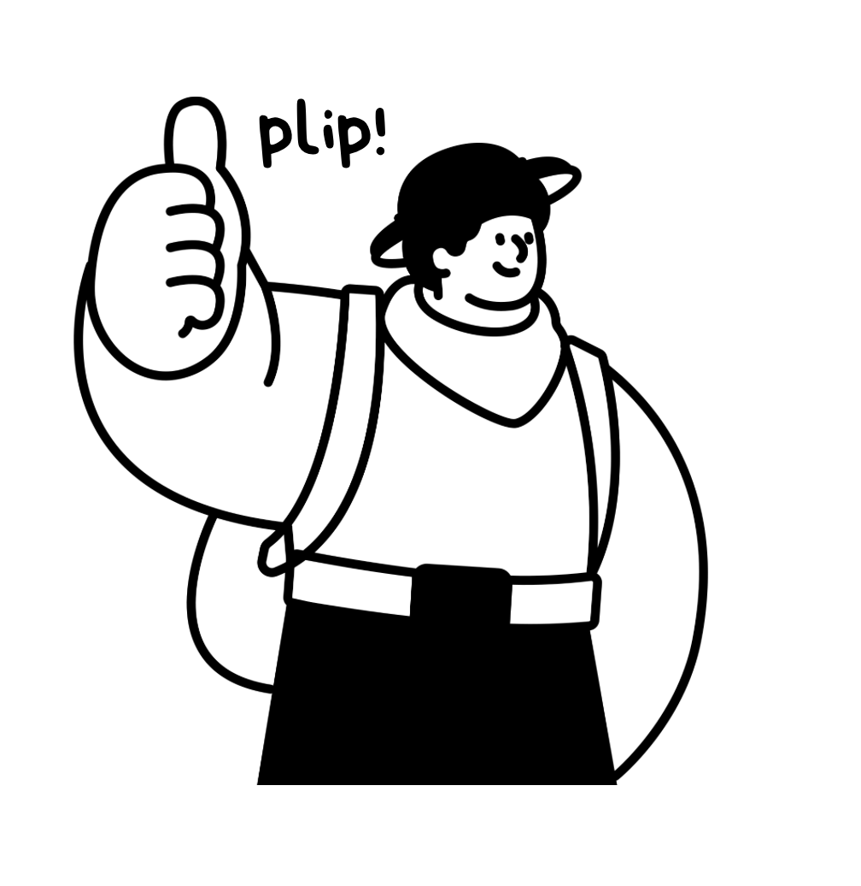

# PLIP-Xplorer 1.0.0



Integración experimental para ChimeraX 1.12.

Esta integración ejecuta **el PLIP de este repositorio** en un entorno Python separado
y representa su informe mediante modelos y pseudobonds nativos de ChimeraX.
No necesita PyMOL ni instala Open Babel dentro del Python de ChimeraX.

## Uso

Instala el plugin y configura el motor siguiendo [INSTALLATION.md](../INSTALLATION.md).
Reinicia ChimeraX si estaba abierto durante la instalación.

1. Abre una estructura que contenga proteína y ligando.
2. Abre **Tools → Structure Analysis → PLIP-Xplorer**.
3. Elige la estructura y una carpeta para los resultados. Selecciona el Python del motor
   que preparaste durante la instalación. Si mueves el entorno, actualiza esta ruta.
4. Pulsa **Analyze structure**. El análisis se ejecuta en segundo plano y se puede cancelar.
5. Elige el ligando, activa/desactiva los tipos de interacción y usa **Focus binding site**.
   Al pulsar una fila se selecciona el residuo receptor. El detalle de distancias,
   ángulos, índices y coordenadas aparece al pasar el cursor por la fila.
6. Personaliza la vista en **Appearance**, exporta una figura en **Export image**,
   o guarda CSV y la escena `.cxs` desde **Analysis**.

## Personalización y figuras (0.2)

La pestaña **Appearance** previsualiza los cambios sobre el resultado actual:

- **Scene**: fondo de cualquier color (incluidos blanco y negro), iluminación
  simple/suave/completa/plana, material mate/brillante, contornos, niebla de profundidad
  y cámara perspectiva u ortográfica. Estos controles afectan a toda la escena de ChimeraX.
- **Molecule**: cartoon y su transparencia, colores independientes de ligando y receptor,
  conservación opcional de colores por elemento, sticks/balls/spheres, grosor de enlaces,
  visibilidad de hidrógenos disponibles, aguas y puntos de las interacciones.
- **3D labels**: etiquetas de residuos y ligando, distancias de PLIP en Å, formato
  nombre/cadena/número, fuente, tamaño, color automático o personalizado, cajas de fondo,
  prioridad visual y desplazamiento independiente de etiquetas de residuos y distancias.
- **Interaction colors and lines**: color, radio y cantidad de guiones por cada uno
  de los ocho tipos de interacción; cero guiones produce líneas continuas.

**Apply preset** ofrece Original, Publication (fondo blanco y etiquetas), Dark presentation
y Illustration. **Save as default** recuerda la apariencia para nuevos paneles.
**Save style / Load style** permite compartir ajustes mediante JSON. Volver al preset
Original restaura los valores visuales iniciales. Los filtros por interacción actualizan
las etiquetas; enfocar el sitio conserva el estilo elegido.

Para separar etiquetas que se superponen, activa **Move individual labels with
right-button drag** y arrastra cada etiqueta. Al desactivarlo o cerrar el panel se
restaura la función anterior del botón derecho. Haz este ajuste después de elegir
estilo y filtros: cambiar esos controles reconstruye las etiquetas. La exportación
y el guardado `.cxs` conservan la colocación manual; el JSON guarda solo el estilo global.

**Export image** guarda PNG, TIFF o JPEG con ancho/alto en píxeles, proporción opcional
de la ventana, antialiasing por supersampling y calidad JPEG. PNG/TIFF admiten fondo
transparente. Para imágenes transparentes que se colocarán sobre otro fondo, elige un
color de texto que contraste con ese fondo de destino. El DPI no se configura: los
píxeles determinan el detalle exportado.

La opción **Only the current PLIP structure and its drawings** aísla temporalmente
el resultado al exportar y restaura la visibilidad de los demás modelos, incluso si falla
la exportación. Desactívala para exportar toda la escena visible. La orientación y el zoom
son los actuales de ChimeraX. Cambiar la relación de aspecto puede cambiar el encuadre.
Para evitar renders excesivos, la combinación tamaño × supersampling se limita a
100 millones de píxeles internos, además del límite de la tarjeta gráfica.

Las etiquetas de distancia utilizan el **valor reportado por PLIP**, no otra detección
de ChimeraX. En puentes de agua, cada tramo muestra la distancia correspondiente según
quién es donante. Las distancias de anillos/grupos corresponden a sus centros. Los estilos
no cambian umbrales, coordenadas, conteos ni XML/CSV. Las etiquetas 3D y los colores se
conservan en `.cxs`; el panel se vuelve a abrir/cargar como en la versión anterior.

La exportación utiliza el [renderizador y formatos nativos de ChimeraX](https://www.cgl.ucsf.edu/chimerax/docs/user/commands/save.html).
Los modos de luz corresponden a sus [opciones nativas de iluminación](https://www.cgl.ucsf.edu/chimerax/docs/user/commands/lighting.html).

El resultado es una **copia estática de las coordenadas activas**. La estructura de
entrada se oculta al terminar correctamente; puede volver a mostrarse desde Models.
Los dibujos siguen los movimientos rígidos de la copia. Para otra conformación,
un fotograma diferente o coordenadas editadas, vuelve a analizar.

## Instalación en otro equipo

Requisitos: ChimeraX 1.12 y una instalación de Conda/Miniforge.
La integración está probada en macOS; Windows y Linux requieren validación propia.

Desde la raíz del repositorio, en una terminal:

```sh
python3 chimerax/setup_backend.py
```

En Windows se puede usar `python` en lugar de `python3`. Si Conda no aparece en PATH,
añade `--conda /ruta/a/conda`. El script crea `.plip-env`, instala PLIP con Open Babel
y genera `.plip-env/configure-chimerax.cxc`. No modifica otros entornos existentes.

En la línea de comandos **de ChimeraX**, instala el wheel distribuido:

```text
toolshed install /ruta/chimerax_plip_xplorer-1.0.0-py3-none-any.whl
```

Luego abre `configure-chimerax.cxc` en ChimeraX. También puedes seleccionar el
ejecutable Python del entorno desde el panel del plugin.

Si trabajas desde código fuente, la alternativa al wheel es:

```text
devel install /ruta/plip-master/chimerax
```

El sistema de paquetes y su instalación siguen el
[formato de bundles de ChimeraX](https://www.cgl.ucsf.edu/chimerax/docs/devel/tutorials/tutorial_hello.html).

## Comandos

```text
plip settings python /ruta/al/entorno/bin/python
plip analyze #1
plip analyze #1 output /ruta/resultados wait true
plip analyze #1 noHydro true
plip load /ruta/report.xml structure #1
```

Las rutas con espacios deben ir entre comillas. En Windows, el Python del entorno
es `C:\ruta\entorno\python.exe`. `wait true` espera a que termine el cálculo;
sin interfaz gráfica se espera siempre. `plip load` no necesita el motor instalado,
pero exige un modelo en el mismo sistema de coordenadas que el informe.

## Equivalencia científica y visualización

El plugin no recalcula contactos con los criterios de ChimeraX: ejecuta
`python -m plip.plipcmd` y lee su XML sin alterar distancias ni umbrales.

| Interacción | Representación |
|---|---|
| Hidrofóbica | Entre los carbonos indicados por PLIP |
| Puente de hidrógeno | Entre donante y aceptor; distancia D–A |
| Puente de agua | Dos segmentos: ligando–agua–receptor |
| Puente salino | Entre los centros de los grupos reportados |
| Apilamiento π | Entre los centros de los anillos |
| π–catión | Entre los centros del anillo y del grupo cargado |
| Enlace de halógeno | Entre los extremos reportados por PLIP |
| Coordinación metálica | Entre metal y átomo coordinante |

Los centros se representan como pequeños marcadores y cada categoría puede
ocultarse independientemente. Un puente de agua cuenta como **una interacción**, aunque
tenga dos segmentos. Su tabla muestra distancias aceptor–agua / donante–agua.

La equivalencia requiere **el mismo PDB preparado, versiones y opciones**. Exportar
desde ChimeraX puede cambiar numeración, selección de conformaciones alternativas o
metadatos respecto del archivo original. La adición de hidrógenos de PLIP puede variar
entre ejecuciones. Para comparar resultados, prepara/protona una sola estructura y
usa `noHydro true` tanto en el plugin como `--nohydro` en PLIP convencional.

Cada ejecución crea una subcarpeta con `input.pdb`, `report.xml`, `report.txt`,
`engine.log` y `provenance.json`; este último registra comando, versión y hashes de
entrada/salida. PLIP también puede escribir el PDB protonado. Los resultados permanecen
en disco aunque se cierre ChimeraX. CSV incluye todos los ligandos y tipos, incluso
los ocultos por los filtros de visualización.

## Alcance de esta versión

- Complejos de moléculas pequeñas y sitios metálicos en el modo estándar de PLIP.
- Una estructura y su conjunto de coordenadas activo por ejecución.
- PDB convencional: hasta 99.999 átomos, cadenas de un carácter y numeración de
  residuos entre −999 y 9999. mmCIF solo si puede exportarse dentro de esos límites.
- La sesión `.cxs` conserva estructuras y dibujos nativos. El panel y su tabla no se
  serializan; usa **Load PLIP XML** sobre la copia analizada para reconstruir la tabla
  (esto crea otro grupo de dibujos; cierra el grupo anterior si no lo necesitas).
- No se exponen todavía los modos péptido, intracadena, regiones, receptor de ADN/ARN
  ni todos los umbrales avanzados del CLI. No se hace seguimiento de trayectorias.
- Informes de estructuras con coordenadas o conformaciones alternativas distintas
  pueden ser rechazados por la comprobación geométrica; no se ajustan automáticamente.
- La instalación del motor requiere Conda y acceso a los paquetes. El wheel es Python
  puro, pero no incorpora Open Babel: todavía no es un instalador autónomo de un clic.

## Desarrollo y validación

```sh
python3 -m unittest discover -s chimerax/test -v
```

Prueba real dentro de ChimeraX, tras instalar el bundle:

```sh
/Applications/ChimeraX-1.12.app/Contents/bin/ChimeraX --nogui --exit \
  --script 'chimerax/test/in_chimerax.py /ruta/plip-master /ruta/plip-master/.plip-env/bin/python'
```

Genera `chimerax/validation/smoke.cxs` y un archivo `smoke-ok.txt` si pasan las
comprobaciones de geometría, movimiento y guardado/restauración de sesión.
La salida de ChimeraX puede contener errores aunque el proceso termine con código
0: comprueba el marcador de éxito y el registro.

Para generar el wheel desde ChimeraX:

```text
devel build /ruta/plip-master/chimerax
```

Los módulos del adaptador están en `chimerax/src/`; no se cambió el motor de detección
ni el visualizador PyMOL. La licencia es GPLv2, como PLIP. Esta integración no es una
publicación oficial de UCSF ni PharmAI. Para la cita científica, consulta la versión
de PLIP y su `citation_information` en el informe.

El nombre visible es PLIP-Xplorer; los comandos `plip` y el módulo interno
`chimerax.plip` conservan sus nombres para mantener compatibilidad.

## Idioma de la interfaz

El selector de la cabecera ofrece inglés, español, alemán, francés, chino simplificado,
japonés y portugués de Brasil. El cambio es inmediato, se guarda entre aperturas y no
modifica el análisis, los valores de estilo ni las etiquetas 3D colocadas manualmente.
Los archivos científicos y los comandos mantienen sus identificadores originales.
Los registros del motor y los mensajes de ChimeraX conservan su idioma de origen.

<small>© 2026 Structural Bioinformatics & Bioactive Compound Synthesis Lab - UFRO</small>
